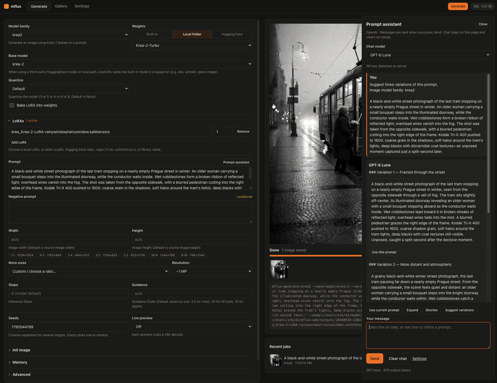
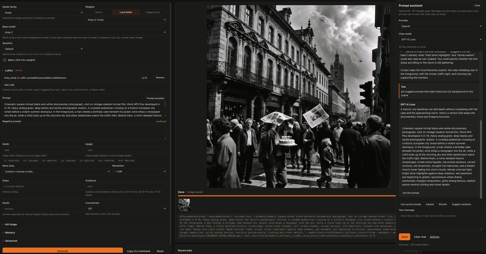
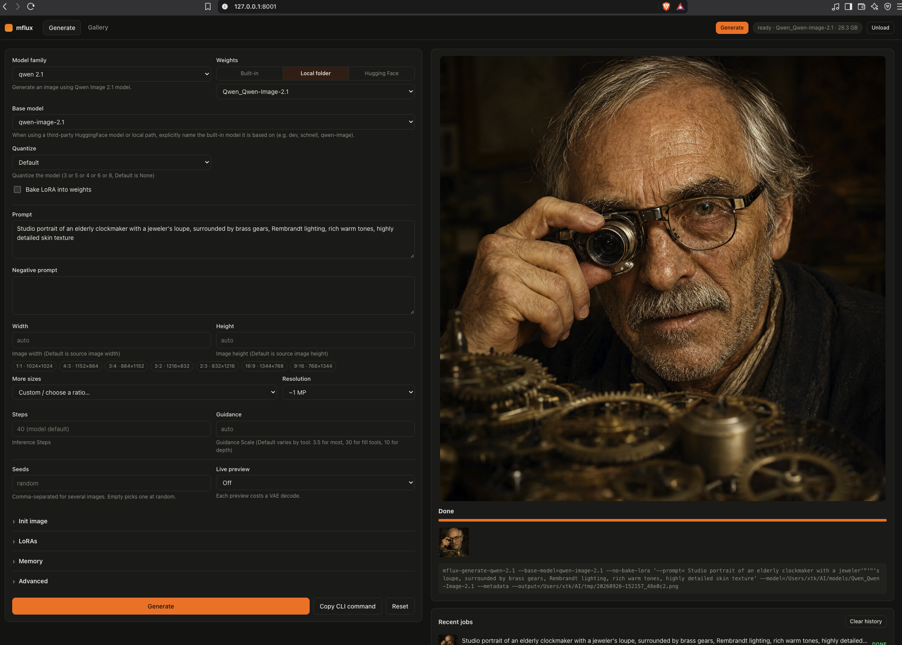

[](https://pypi.org/project/mflux/)
[](https://pypi.org/project/mlx/)
[](https://github.com/filipstrand/mflux/actions/workflows/tests.yml)
[](https://www.greptile.com/?utm_source=oss_badge&utm_medium=readme&utm_campaign=greptile_for_open_source)

# About

mflux runs generative image models locally on Apple silicon using MLX. This fork adds `mflux-web`, a lightweight browser interface for generating images, exploring prompt ideas, and browsing results.

## Web UI

I built the UI because I wanted to try new prompts without typing long commands each time. Pick a model, write a prompt, and press **Generate**. The forms are built from the supported CLI commands' options, and requests are validated by those commands' own argument parsers. With model caching enabled, weights stay loaded between runs so repeated generations can skip the loading step.

The optional prompt assistant helps develop ideas using local oMLX inference or the OpenAI API. A startup progress bar shows which command options or local files are being loaded, while the gallery keeps generated images and their settings easy to revisit.



*Generate with the local oMLX prompt assistant. Generation controls are on the left; the result and equivalent CLI command are on the right. Use **Copy CLI command** to take a run back to the terminal. The top bar shows worker status and memory use, with an **Unload** button when a cached model can be released.*



*The same prompt assistant connected to OpenAI, with GPT-6 Luna and GPT-6 Sol available. **Use this prompt** transfers a suggestion into the generation form. Each provider keeps its own conversation and draft.*



*The gallery. Open an image to inspect its generation settings, download it, or use **Reuse settings** to restore its options and seed in the form.*

---

### Install and run

Install this fork with the `web` extra (this replaces an existing `uv tool` install of mflux):

```bash
uv tool install --force --refresh --python 3.14 "mflux[web] @ git+https://github.com/x746b/mflux@main"
```

#### Run

```bash
mflux-web --models-dir ~/AI/models/_diffusers_ --lora-dir ~/AI/models/_diffusers_/_LoRAs_ --output-dir ~/AI/mflux-web/outputs --max-memory-gb 110 --cache-size 0
```

Then open http://127.0.0.1:8001.

Adjust the paths and memory budget to suit your machine. The example uses `--cache-size 0` to unload weights after each run; omit it to keep a model cached for repeated generations.

`--models-dir` is the folder where you keep downloaded checkpoints. Each subfolder shows up under Weights → Local folder. Generated images land in `--output-dir`, each with a small JSON file holding its settings; that is what the gallery reads.

---

### News

- **Prompt assistant:** discuss ideas with GPT-6 Luna, GPT-6 Sol, or an oMLX model, expand or shorten prompts, and insert suggestions into the generation form. Enable or disable the assistant in Settings.
- **Settings tab:** choose System, Light, or Dark appearance with Orange, Blue, or Teal accents. Select the assistant provider and check its configuration, Hugging Face token status, loaded models, directories, memory limits, and idle unload time.
- **Startup progress:** see which command is loading, followed by model-folder and LoRA scans, with elapsed time and a progress bar. Detailed timings are available in the server log.
- **Easier LoRA selection:** LoRAs sit directly below the model controls and display paths relative to `--lora-dir`. Bake LoRA into weights is unchecked by default.
- **Local weights by default:** starting with `--models-dir` selects Local folder for fresh or reset forms. Saved selections still take precedence.
- **Qwen Image 2.1 editing:** use up to 10 ordered reference images, keep uploads when switching model families, and reuse settings from the gallery.
- **Memory controls:** configure an active-memory budget and idle unloading, monitor memory in the top bar, and unload cached models when needed.

---

### Good to know

- **Prompt assistant.** Enabled by default; uncheck **Enable prompt assistant** in Settings to hide its button and stop active replies in tabs of this browser. Choose OpenAI with GPT-6 Luna (default) or GPT-6 Sol, or oMLX with the model configured on the server. **Use current prompt**, **Expand**, **Shorten**, and **Suggest variations** prepare a draft; **Send** starts the request. Replies stream, **Stop** cancels the connection, and **Use this prompt** inserts a suggestion after confirming replacement. Each provider has its own in-memory history and draft, so switching providers does not transfer conversations. Chat clears on reload/navigation; **Clear chat** resets only the selected provider's history and leaves the generation prompt untouched. Settings saves provider/model/style preferences per browser. OpenAI API charges apply; oMLX uses its configured inference server.
- **Settings.** The Settings tab shows whether the server detects a Hugging Face token, with login instructions if needed. This is a local presence check, not a validation of access; tokens are never displayed or stored by the Web UI. Choose System, Light, or Dark appearance and an Orange, Blue, or Teal accent; appearance is saved per browser. Runtime information lists loaded models, model/LoRA/output directories, the effective memory budget, and idle unload time. Use Refresh status to update this snapshot; change server options at startup.
- **Built-in or Local folder.** "Built-in" downloads the model from Hugging Face. With `--models-dir`, fresh or reset forms default to Local folder; set the base model to match the checkpoint (for example `qwen-image-2.1`). Saved form selections take precedence over defaults.
- **LoRAs.** The LoRA section is directly below Base model and Quantize. Local choices show paths relative to `--lora-dir`, with numbered labels for duplicate names across directories. Full paths are retained for generation. You can also enter a path, Hugging Face repository, or library name. **Bake LoRA into weights** is unchecked by default; saved settings can restore a previous choice.
- **Sizes.** The small buttons are the usual sizes around 1 megapixel. "More sizes" has wider ratios (16:10, 21:9, 2.39:1, 32:9 and portrait versions), and "Resolution" scales them from 0.5 to 4 MP.
- **Several images at once.** Put `1, 2, 3` in Seeds and you get three images from one run.
- **No scrolling to the button.** Generate is also in the top bar, and Cmd/Ctrl+Enter works anywhere in the form.
- **Memory.** The active MLX memory budget defaults to 75% of RAM; set `--max-memory-gb 64` to lower it when other apps or an LLM also need memory. The buffer cache stays capped at 25% of that budget. Jobs stop at callback checkpoints if active memory exceeds the budget, queued jobs are cancelled, and cached models unload. Retained-memory growth also triggers unloading between jobs. This is a soft guard, not a hard process-memory ceiling. The top-bar tooltip shows both limits. Use `--cache-size 0` to unload after every run, or `--idle-unload MINUTES` to change the default 10-minute idle timeout.
- **History.** Recent jobs are kept only in memory and are gone when the server stops. "Clear history" drops finished jobs, unused uploads and saved generation drafts. Appearance and assistant preferences are kept, as are references needed by queued or running jobs. Images in the gallery stay until you delete them there. Use **Clear chat** separately to reset the prompt conversation.
- **Queue capacity.** Up to 16 pending generation jobs can wait behind the running job. Further submissions receive a queue-full message and can be retried later. Each job can still contain several seeds.
- **Supported models.** Text-to-image, plus image-to-image and LoRAs, for FLUX.1, FLUX.2, Qwen Image, Qwen Image 2.1, Z-Image, Krea 2 and ERNIE-Image. Qwen Image 2.1 editing is also available; other edit commands, ControlNet, fill and upscaling are still CLI-only.
- **Qwen 2.1 editing.** Choose **qwen 2.1 edit**, select your Qwen-Image-2.1 weights, and add up to 10 reference images. Their order matches “image 1”, “image 2”, etc. in your prompt. Leave width and height empty to derive the size from the last reference and the advanced **Output resolution** setting; explicit dimensions must be multiples of 32. RGBA output is saved as PNG. **Use KV cache** can be disabled in Advanced. Editing requires at least two steps and guidance of 1 or more; it does not support LoRAs yet.
- **Quiet console.** The page polls the server all the time. Those requests are only logged with `--log-level debug`.
- **Initial loading.** The Generate page shows the command currently loading, then the model-folder and LoRA scans, with elapsed time and a progress bar. Progress counts completed discovery steps, not estimated time remaining. The server logs how long each command schema takes on its first build, followed by totals for schema setup, model-folder discovery, and LoRA scanning. Shared dependency imports count toward the first command that needs them; later requests reuse cached schemas. If loading fails, the page shows an error and a reload button.

### OpenAI prompt assistant setup

The server reads `OPENAI_API_KEY` from its environment. For a terminal launch, add this line to your `~/.zshrc` using an editor, replacing the placeholder locally:

```bash
export OPENAI_API_KEY="your-api-key"
```

Open a new terminal, then start `mflux-web` with your usual options. An already-running server must be restarted to inherit the key. Alternatively, export the variable only in the shell used to start the server. Background services need their own environment configuration; the Web UI does not read or execute `~/.zshrc` or load `.env` files.

Keep credentials outside the repository. The browser receives only key-presence status, never the key. Opening the assistant or Settings makes no paid request. Sending a chat message uses your API project; anybody permitted to use this Web UI can use its configured assistant. No image, local model path, or generation prompt is automatically attached. Requests use the Responses API with `store=false`, no tools, low reasoning, and bounded context/output; conversation history is explicitly resent with each turn.

The assistant currently supports `gpt-6-luna` and `gpt-6-sol`. Access depends on your API project. Provider errors are shown without exposing provider diagnostics or credentials. Cancelling closes the stream; work already processed may still be billed.

Chat requests have an overall deadline of two minutes for OpenAI and five minutes for oMLX, including model loading and response streaming. A timeout closes the upstream connection and frees the chat slot. Responses are limited to 2 MiB in total, with individual SSE lines and events limited to 256 KiB before JSON parsing. Streaming requests use uncompressed responses so these limits also bound decoding buffers.

Reference: [OpenAI API setup](https://developers.openai.com/api/docs/quickstart) and [streaming responses](https://developers.openai.com/api/docs/guides/streaming-responses).

### oMLX prompt assistant setup

Add these exports to the environment that launches `mflux-web`, for example in `~/.zshrc`. Replace the key placeholder locally and use the exact model name or alias shown in oMLX:

```bash
export OMLX_API_KEY="your-omlx-api-key"
export OMLX_MFLUX_MODEL="Qwen3.6-35B-A3B-8bit"
# Optional: this is the default API base address.
export OMLX_BASE_URL="http://127.0.0.1:8000/v1"
```

Open a new terminal and restart `mflux-web`, then choose **oMLX** in Settings → Prompt assistant or in the chat panel. Both the key and model variable are required. oMLX must be running and recognize the configured model. The Web UI inherits exported variables; it does not source `~/.zshrc` or store credentials in the browser.

Plain HTTP is allowed only for loopback addresses or `localhost`; `localhost` is normalized to `127.0.0.1`. For an oMLX server on another machine, use an HTTPS API base URL with a valid certificate. Redirects are not followed.

Both providers share the assistant's instructions, style preferences, prompt actions, and context/output limits. oMLX uses streaming Chat Completions and requests non-thinking replies for responsive prompt editing. Its response timeout allows additional time for local model loading. Opening Settings or the assistant only checks configuration locally; it does not contact the inference server or load models. Missing oMLX configuration or a connection failure never falls back to OpenAI automatically.

The enable switch is a browser preference, not a server access control. Normal Web UI authentication still protects both chat backends. Local inference shares system memory with image generation; mflux does not manage oMLX's model cache.

Reference: [oMLX documentation](https://github.com/jundot/omlx).

### Using it from another machine

Out of the box `mflux-web` listens only on 127.0.0.1 and has no password, which is fine when you are the only user of your Mac. The simplest way to use it from a laptop is an SSH tunnel, which needs no configuration at all:

```sh
ssh -L 8001:127.0.0.1:8001 you@your-mac
# then open http://127.0.0.1:8001 on the laptop
```

If you do want it on the network, it will not start without an API key. Pass the key through the environment, since command lines are visible to other users on the machine:

```sh
export MFLUX_WEB_API_KEY='something-long-and-random'
mflux-web --host 0.0.0.0 --models-dir ~/AI/models
```

This is plain HTTP, so for anything beyond your home network put TLS in front. With Tailscale that is `tailscale serve --bg 8001`, plus `--allowed-host your-mac.your-tailnet.ts.net --behind-https` for mflux-web. Or use `--tls-cert` / `--tls-key` directly.

Whatever you choose, the UI only reads models from `--models-dir` (and LoRAs from `--lora-dir`) and only writes to `--output-dir`. It cannot be pointed at other files on the machine. `mflux-web --help` lists every option.

Login and bearer-key authentication share failed-attempt throttling. Requests exceeding the authentication or queue limit return HTTP 429 with a `Retry-After` header. Incoming request bodies are limited before parsing: 16 KiB for login/setup, 256 KiB for ordinary JSON requests, 320,000 bytes for chat, and the configured upload size plus 1 MiB of multipart overhead for uploads. The individual uploaded image must still fit `--max-upload-mb`. Oversized bodies return HTTP 413.

### Keeping up with upstream

The web UI lives almost entirely in new files, so merging upstream mflux is mostly painless. [docs/upstream-changes-deps.md](docs/upstream-changes-deps.md) lists the few upstream files this fork changes, which upstream code the UI depends on, and the steps for each sync.

---

## Original README

### Table of contents

- [Web UI](#web-ui)
- [💡 Philosophy](#-philosophy)
- [💿 Installation](#-installation)
- [🎨 Models](#-models)
- [✨ Features](#-features)
- [🦄 Contributors](#-contributors)
- [🌱 Related projects](#related-projects)
- [🙏 Acknowledgements](#-acknowledgements)
- [⚖️ License](#%EF%B8%8F-license)

---

### 💡 Philosophy

MFLUX is a line-by-line MLX port of several state-of-the-art generative image models from the [Huggingface Diffusers](https://github.com/huggingface/diffusers) and [Huggingface Transformers](https://github.com/huggingface/transformers) libraries. All models are implemented from scratch in MLX, using only tokenizers from the [Huggingface Transformers](https://github.com/huggingface/transformers) library. MFLUX is purposefully kept minimal and explicit, [@karpathy](https://gist.github.com/awni/a67d16d50f0f492d94a10418e0592bde?permalink_comment_id=5153531#gistcomment-5153531) style.

---

### 💿 Installation
If you haven't already, [install `uv`](https://github.com/astral-sh/uv?tab=readme-ov-file#installation), then run:

```sh
uv tool install --upgrade mflux
```

After installation, the following command shows all available MFLUX CLI commands: 

```sh
uv tool list 
```

To generate your first image using, for example, the z-image-turbo model, run

```
mflux-generate-z-image-turbo \
  --prompt "A puffin standing on a cliff" \
  --width 1280 \
  --height 500 \
  --seed 42 \
  --steps 9 \
  -q 8
```


The first time you run this, the model will automatically download which can take some time. See the [model section](#-models) for the different options and features, and the [common README](src/mflux/models/common/README.md) for shared CLI patterns and examples.

<details>
<summary>Python API</summary>

Create a standalone `generate.py` script with inline `uv` dependencies:

```python
#!/usr/bin/env -S uv run --script
# /// script
# requires-python = ">=3.10"
# dependencies = [
#   "mflux",
# ]
# ///
from mflux.models.z_image import ZImageTurbo

model = ZImageTurbo(quantize=8)
image = model.generate_image(
    prompt="A puffin standing on a cliff",
    seed=42,
    num_inference_steps=9,
    width=1280,
    height=500,
)
image.save("puffin.png")
```

Run it with:

```sh
uv run generate.py
```

For more Python API inspiration, look at the [CLI entry points](src/mflux/models/z_image/cli/z_image_turbo_generate.py) for the respective models.
</details>

<details>
<summary>⚠️ Troubleshooting: hf_transfer error</summary>

If you encounter a `ValueError: Fast download using 'hf_transfer' is enabled (HF_HUB_ENABLE_HF_TRANSFER=1) but 'hf_transfer' package is not available`, you can install MFLUX with the `hf_transfer` package included:

```sh
uv tool install --upgrade mflux --with hf_transfer
```

This will enable faster model downloads from Hugging Face.

</details>

<details>
<summary>DGX / NVIDIA (uv tool install)</summary>

```sh
uv tool install --python 3.13 mflux
```
</details>

---

### 🎨 Models

MFLUX supports the following model families. They have different strengths and weaknesses; see each model’s README for full usage details.

| Model | Release date | Size | Type | Training | Description |
| --- | --- | --- | --- | --- | --- |
|[Z-Image](src/mflux/models/z_image/README.md) | Nov 2025 | 6B | Distilled & Base | Yes | Fast, small, very good quality and realism. |
|[Krea 2](src/mflux/models/krea2/README.md) | Jun 2026 | 12B | Turbo (distilled) | No | Very good quality with a wide range of styles; good for creative exploration. |
|[FLUX.2](src/mflux/models/flux2/README.md) | Jan 2026 | 4B & 9B | Distilled & Base | Yes | Fastest + smallest with very good quality and edit capabilities. |
|[Ideogram 4](src/mflux/models/ideogram4/README.md) | Jun 2026 | 9B | Base | No | JSON-caption-native, typography-focused text-to-image generation. |
|[ERNIE-Image](src/mflux/models/ernie_image/README.md) | Apr 2026 | 8B | Distilled & Base | No | Single-stream DiT from Baidu. Vivid, high-contrast output. |
|[Lens](src/mflux/models/lens/README.md) | May 2026 | 3.8B (+20B TE) | Turbo (distilled) | No | Dual-stream MMDiT from Microsoft with a GPT-OSS text encoder. Strong prompt adherence in 4 steps. |
|[Ming-Image](src/mflux/models/ming_image/README.md) | Sep 2026 | 6.15B (+16B MoE TE) | Base | No | Design-focused (posters, cards, UI) with strong typography; outputs RGBA. |
|[Boogu Image](src/mflux/models/boogu/README.md) | Jun 2026 | 10B | Turbo (distilled) | No | DMD-distilled 4-step model with a photographic look and bilingual (EN/ZH) text rendering. |
|[FIBO](src/mflux/models/fibo/README.md) | Oct 2025+ | 8B | Distilled & Base | No | Very good JSON-based prompt understanding. Has edit capabilities. |
|[SeedVR2](src/mflux/models/seedvr2/README.md) | Jun 2025 | 3B & 7B | — | No | Best upscaling model. |
|[Qwen Image](src/mflux/models/qwen/README.md) | Aug 2025+ | 20B | Base | No | Large model (slower); strong prompt understanding and world knowledge. Has edit capabilities |
|[Qwen Image 2.1](src/mflux/models/qwen21/README.md) | Sep 2026 | 7.1B (+8B TE) | Base | No | Single-stream block-causal DiT with a Qwen3-VL text encoder; 40-step guidance-free sampling. [Multi-reference editing and RGBA](src/mflux/models/qwen21/reference/README.md). |
|[Depth Pro](src/mflux/models/depth_pro/README.md) | Oct 2024 | — | — | No | Very fast and accurate depth estimation model from Apple. |
|[FLUX.1](src/mflux/models/flux/README.md) | Aug 2024 | 12B | Distilled & Base | No (legacy) | Legacy option with decent quality. Has edit capabilities with 'Kontext' model and upscaling support via ControlNet |

---

### ✨ Features

**General**
- Quantization and local model loading
- LoRA support (multi-LoRA, scales, library lookup), including LyCORIS LoKr on FLUX.1 and FLUX.2
- Metadata export + reuse, plus prompt file support

**Model-specific highlights**
- Text-to-image and image-to-image generation.
- LoRA finetuning
- In-context editing, multi-image editing, and virtual try-on
- ControlNet (Canny), depth conditioning, fill/inpainting, and Redux
- Upscaling (SeedVR2 and Flux ControlNet)
- Depth map extraction and FIBO prompt tooling (VLM inspire/refine)

See the [common README](src/mflux/models/common/README.md) for detailed usage and examples, and use the model section above to browse specific models and capabilities.

> [!NOTE]
> As MFLUX supports a wide variety of CLI tools and options, the easiest way to navigate the CLI in 2026 is to use a coding agent (like [Cursor](https://cursor.com), [Claude Code](https://www.anthropic.com/claude-code), or similar). Ask questions like: “Can you help me generate an image using z-image?”


---

<a id="contributors"></a>

### 🦄 Contributors


MFlux was originally created by [Filip Strand](https://github.com/filipstrand)

---

<a id="related-projects"></a>

### 🌱 Related projects

- [MindCraft Studio](https://themindstudio.cc/mindcraft#models) — macOS app built on mflux by [@shaoju](https://github.com/shaoju)
- [mflux-paint](https://github.com/Amo643/mflux-paint) — native macOS inpaint/edit app (pywebview), 16 models across edit/inpaint/text-to-image, mask painting, multi-seed batch, by [@Amo643](https://github.com/Amo643)
- [Mflux-ComfyUI](https://github.com/raysers/Mflux-ComfyUI) by [@raysers](https://github.com/raysers)
- [MFLUX-WEBUI](https://github.com/CharafChnioune/MFLUX-WEBUI) by [@CharafChnioune](https://github.com/CharafChnioune)
- [mflux-fasthtml](https://github.com/anthonywu/mflux-fasthtml) by [@anthonywu](https://github.com/anthonywu)
- [mflux-streamlit](https://github.com/elitexp/mflux-streamlit) by [@elitexp](https://github.com/elitexp)
- [mlx-taef](https://github.com/IonDen/mlx-taef) — TAESD/TAEF tiny-autoencoder live previews and low-memory FLUX decode for mflux, by [@IonDen](https://github.com/IonDen)
- [mlx-teacache](https://github.com/IonDen/mlx-teacache) — TeaCache step-skipping to speed up FLUX generation in mflux, by [@IonDen](https://github.com/IonDen)
- [MLXBits Image Studio](https://github.com/MLXBits/image-studio) - A native macOS Swift app for FLUX, Krea 2, Z-Image and more!
---

### 🙏 Acknowledgements

MFLUX would not be possible without the great work of:

- The MLX Team for [MLX](https://github.com/ml-explore/mlx) and [MLX examples](https://github.com/ml-explore/mlx-examples)
- Black Forest Labs for the [FLUX project](https://github.com/black-forest-labs/flux)
- Bria for the [FIBO project](https://huggingface.co/briaai/FIBO)
- Tongyi Lab for the [Z-Image project](https://tongyi-mai.github.io/Z-Image-blog/)
- Baidu for the [ERNIE-Image project](https://huggingface.co/baidu/ERNIE-Image)
- Ideogram for the [Ideogram 4 project](https://huggingface.co/ideogram-ai/ideogram-4-fp8)
- Krea.ai for the [Krea 2 project](https://www.krea.ai/blog/krea-2-technical-report)
- Qwen Team for the [Qwen Image project](https://qwen.ai/blog?id=a6f483777144685d33cd3d2af95136fcbeb57652&from=research.research-list)
- Microsoft for the Lens (Turbo) model, and Comfy-Org for the [weights repackage](https://huggingface.co/Comfy-Org/Lens)
- inclusionAI for the [Ming-Image project](https://github.com/inclusionAI/Ming-Image)
- The Boogu team for the [Boogu Image project](https://huggingface.co/Boogu/Boogu-Image-0.1-Turbo)
- ByteDance, @numz and @adrientoupet for the [SeedVR2 project](https://github.com/numz/ComfyUI-SeedVR2_VideoUpscaler)
- Hugging Face for the [Diffusers library implementations](https://github.com/huggingface/diffusers) 
- Depth Pro authors for the [Depth Pro model](https://github.com/apple/ml-depth-pro?tab=readme-ov-file#citation)
- The MLX community and all [contributors and testers](https://github.com/filipstrand/mflux/graphs/contributors)

---

### ⚖️ License

This project is licensed under the [MIT License](LICENSE).
